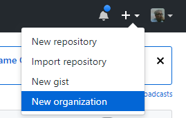
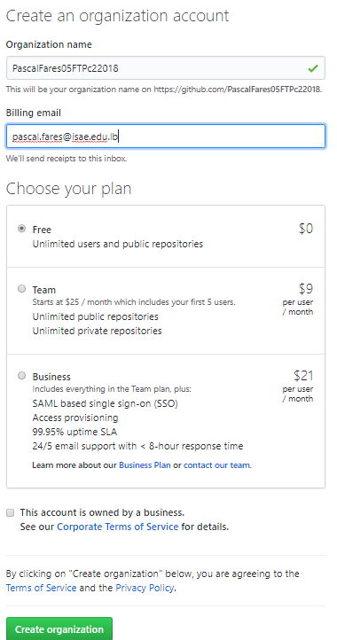
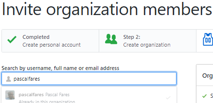

# Pour démarrer

A- Télécharger puis installer

Optimum : Ubuntu ou iOS, Java JDK >8, Netbeans, Maven (avant de venir en cours avec vos portable ... )

Ou

pour ceux qui sont sous windows : Installer github for windows viens avec un Linux bash puis Java JDK >8, Netbeans, Maven (les version windows)

B- utilisation git et github

Ce premier TP vous permet de prendre en main le système basé sur git et github pour la procédure de soumission de vos futurs TP. On vous demande d'écrire la classe Client.java  et les tests unitaires.


La classe Client représente un client; elle possède les attributs suivants, tous de type String : 
```
    private String _id;
    private String _prenom;
    private String _nom;
    private String _telephone;
    private String _rue;
    private String _ville;
    private String _etat;
    private String _code;
    private String _pays;
    private String _mail;
```

nous utilisons et créons aussi, 
 1. Le pattern Builder pour la création d'un nouveaux client
 2. dans cette première version, des méthodes statiques (find (Read), insert(Create), update, remove (Delete)) gérant (par exemple dans une HashMap associant l'id d'un Client et son instance) l'ensemble de ses instances .

# Le pattern Builder avec un exemple

```Java
package net.cofares.opentraining.priseenmain;

public class Data {

    /**
     * Id de la data (obligatoire)
     */
    private final String _id;
    /**
     * Par exemple ATTRIBUT (obligatoire)
     */
    private final String _data;
    /**
     * Un autre exemple d'attribut (option)
     */
    private String _commentaires;
    
    /**
     * Le constructeur avec un builder
     * @param db 
     */
    public Data(DataBuilder db) {
        _id=db._id;
        _data=db._data;
        _commentaires=db._commentaires;
    }

    /**
     * @return the _id
     */
    public String getId() {
        return _id;
    }

    /**
     * @return the _data
     */
    public String getData() {
        return _data;
    }

    /**
     * @return the _commentaires
     */
    public String getCommentaires() {
        return _commentaires;
    }

    /**
     * @param _commentaires the _commentaires to set
     */
    public void setCommentaires(String _commentaires) {
        this._commentaires = _commentaires;
    }

    /**
     * Une classe builder interne (et static)
     * a utiliser par new Data.DataBuilder(___).attribut1(_)....build();
     */
    public static class DataBuilder {

        /**
         * Ide de la data (obligatoire)
         */
        String _id;
        /**
         * Donne de la data (obligatoire)
         */
        String _data;
        /**
         * Commentaire (option)
         */
        String _commentaires;
        
        /** 
         * Constructeur minimal du pattern Builder 
         * est la Liste des attributs obligatoires
         * @param id
         * @param data 
         */
        public DataBuilder(String id,String data) {
            _id=id;
            _data=data;
        }
        /**
         * Paramètre de build tout attribut optionnel renvoi un builder
         * @param commentaire
         * @return un DataBuilder pour enchaîner les mise a jour du builder
         */
        public DataBuilder commentaire(String commentaire) {
            _commentaires=commentaire;
            return this;
        }
        
        /**
         * Le build
         * @return objet à créer
         */
        public Data build(){
            return new Data(this);
        }
    }
}
```

 # Comment rendre les TP?

1. Créer dans gthub une organisation (TPC22018VotreNomVotreIdCnamLiban) exemple PascalFares05FTPC22018




2. M'inviter ensuite dans votre nouvelle organisation (pascalfares)


3. Créer ensuite a l'intérieur de cette organisation les projets (un pour chaque TP)

Visiter et suivre https://classroom.github.com/a/kMJwyNv2

4. Faire un fork dans votre organisation 

5. Réaliser les codes du tp

Faire push dans votre fork, puis pullrequest dans le projet classroom

6. Finalement aller dans [Issues de TP GLG](https://github.com/opentrainingcamp/TP-GLG-Cnam-Liban/issues) et créer une issue disant que vous avez fini votre TP, avec dans le corp de l'issue le lien vers votre projet TP et eventuellement mettre le lien dans un devoir qui serait créé dans la [classroom](https://classroom.google.com/u/1/c/MjQwNTAzNzIxN1pa) en temps utile.
